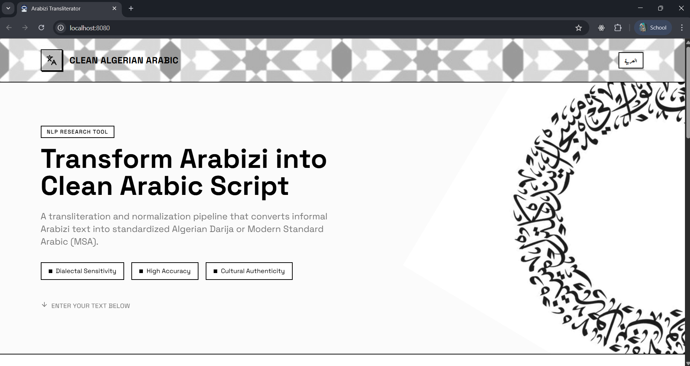
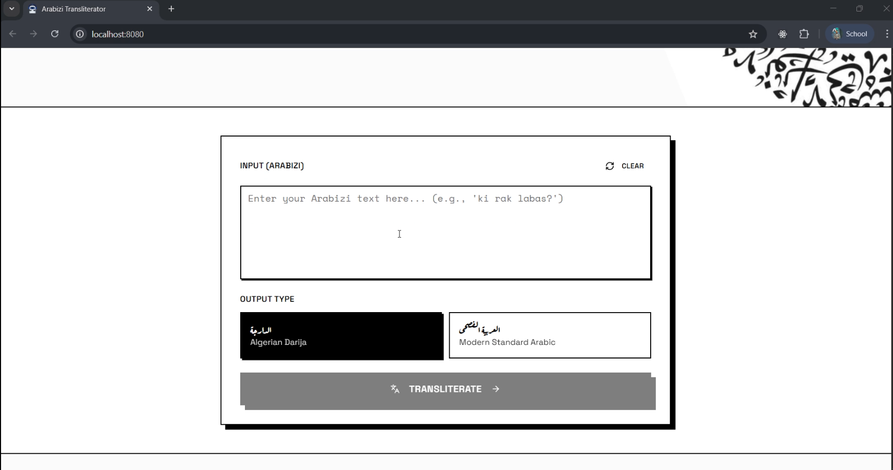
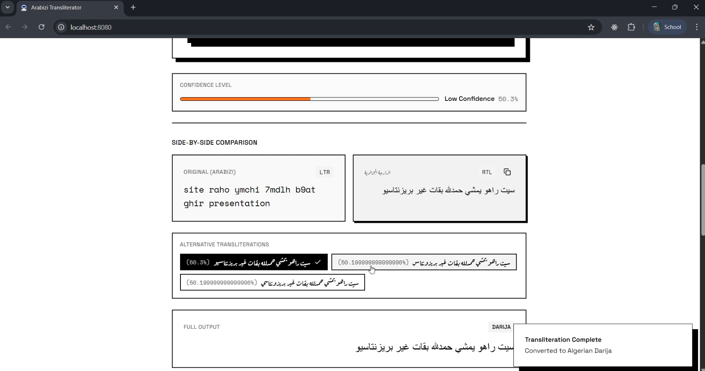
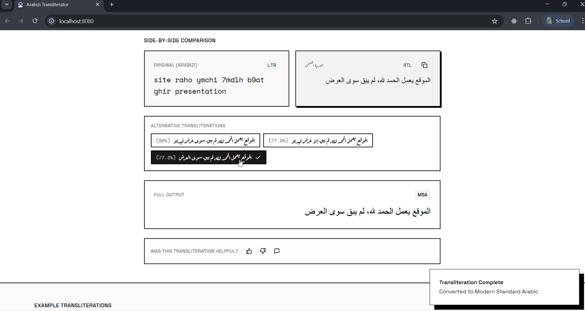
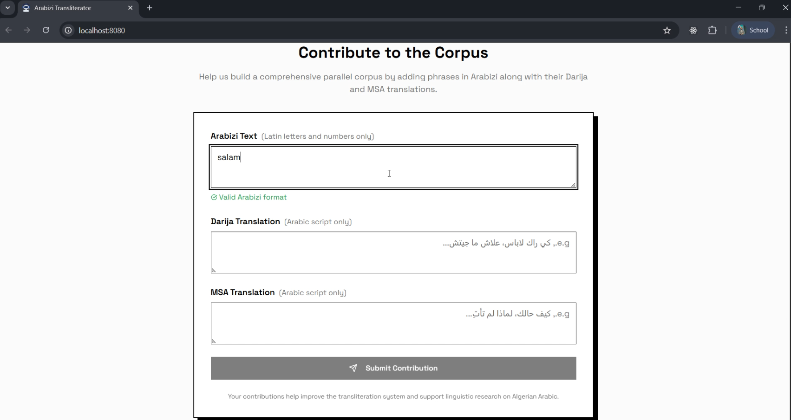

# Franco2Fosha: Neural Translation of Algerian Arabizi to Darija and Modern Standard Arabic



| | |
|:---:|:---:|
|  |  |
| _Arabizi Transliteration_ | _Darija Transliteration_ |
|  |  |
| _MSA Transliteration_ | _Corpus Contribution_ |

## 📖 Overview

**Franco2Fosha** is a comprehensive end-to-end neural NLP pipeline for **direct translation** of **Algerian Arabizi** (Latin-script Arabic dialect) to two output targets:

- **Arabizi → Algerian Darija** (Arabic script - dialectal form)
- **Arabizi → Modern Standard Arabic (MSA)** (formal Arabic - standardized)

Users can translate to either Darija (to preserve dialectal form) or MSA (to standardize to formal Arabic) in a single inference step.

This project bridges the critical gap between informal, user-generated digital content and formal linguistic resources for low-resource North African Arabic dialects.

### The Problem: Arabizi as "Dark Matter" for NLP

**Arabizi** is a spontaneous orthography that uses Latin characters and numerals (arithmograms) to represent Arabic dialects online. While it enables rapid communication for millions of Algerians, it creates fundamental challenges for NLP systems:

- **Orthographic Inconsistency**: The word "why" can be written as `3lah`, `3leh`, `pk`, `pourquoi`, or `3lach` (spelling variance problem)
- **Resource Scarcity**: Unlike Egyptian or Levantine dialects, Algerian lacks large-scale parallel corpora (low-resource NLP challenge)
- **Script Mismatch**: Standard NLP tools trained on Arabic script fail catastrophically on Romanized text (domain shift problem)
- **Code-Switching Intensity**: 35% of sentences contain French loanwords, requiring multilingual understanding

### Our Solution: Parallel Translation Models

Franco2Fosha addresses this challenge using **two parallel neural architectures**, each specialized for its target:

1. **ByT5-Small Model**: Arabizi → Algerian Darija (character-level transliteration)
2. **mBART-Large-50 Model**: Arabizi → Modern Standard Arabic (multilingual translation)

Users select which target they need (Darija or MSA) and the corresponding model performs direct inference on the Arabizi input. Both models process the input independently and in parallel.

This architecture leverages specialized transformers: **byte-level processing** for orthographic normalization to Darija + **multilingual semantic models** for formal MSA translation.

---

## 🔬 Methodology & NLP Techniques

### 1. Data Collection & Preparation Pipeline

#### A. Hybrid Data Collection Strategy

- **Social Media Scraping**: Telegram student communities from all 58 Algerian wilayas + YouTube comments
- **Regional Diversity**: Captures dialect variations (Oran, Algiers, Constantine, Annaba regions)
- **Natural Context**: Conversational, multi-turn discussions (vs. short tweets/comments)
- **Code-Switching**: Preserves realistic 35% French loanword density

#### B. Semi-Supervised Annotation Pipeline (Teacher-Student Approach)

**Phase 1: Synthetic Data Augmentation**

```
PADIC/DZC12 Arabic Dialect Corpus
         ↓
Probabilistic Reverse Transliteration
(ق→9 with 80% prob, q with 20% prob)
         ↓
60,000 "Perfect" Ground-Truth Pairs
```

**Phase 2: LLM-Assisted Pseudo-Labeling**

```
140k Raw Arabizi Messages
         ↓
Prompt Engineering:
"You are an expert Algerian linguist.
Transliterate this Arabizi → Darija → MSA"
         ↓
Gemini 3 Pro + Claude 3.5 Sonnet
         ↓
"Silver Standard" Labels (High Quality)
```

**Phase 3: Human Verification (Quality Control)**

```
30,000 Random Samples → 6 Native Speakers
         ↓
Correction Protocol with Style Guide
(e.g., "Always transcribe '3' as 'ع'")
         ↓
Gold Standard Dataset
```

**Result**: Alg-Arabizi-66.6k - Largest parallel corpus for Algerian Arabizi

### 2. Neural Architectures & Models

#### A. Transliteration Module: ByT5-Small (Character-Level Seq2Seq)

**Why ByT5 for Arabizi?**

- **Token-Free Processing**: Reads raw UTF-8 bytes → eliminates Out-Of-Vocabulary (OOV) problem
- **Phonetic Mapping**: Learns ch ≈ ش, 3 → ع without fixed vocabulary constraints
- **Robustness**: Handles spelling noise (3lah vs 3leh vs pk) naturally

**Architecture**:

```
Input: "choufli hadak l3afsa"
       ↓ (byte sequence)
Encoder (12 layers, 8 attention heads)
       ↓
Cross-Attention with Decoder
       ↓
Decoder (12 layers, 8 attention heads)
       ↓
Output: "شوفلي هداك العفصة"
```

**Training Config**:

- Model Size: 300M parameters
- Learning Rate: 5e-4 (AdaFactor optimizer)
- Batch Size: 32
- Epochs: 15 with early stopping (patience=3)
- Precision: FP32
- Loss: Cross-Entropy

#### B. Translation Module: mBART-Large-50 (Denoising Autoencoder)

**Why mBART for Darija→MSA?**

- **Multilingual Pre-Training**: Trained on 50 languages including Arabic variants
- **Semantic Understanding**: Captures formal MSA grammar & vocabulary
- **Transfer Learning**: Leverages massive Arabic semantic knowledge
- **Denoising**: Designed to handle noisy, dialectal input

**Architecture**:

```
Input: Darija "شوفلي هداك العفصة"
       ↓
SentencePiece Tokenizer (ar_AR)
       ↓
Encoder (12 layers, 16 attention heads)
       ↓
Cross-Attention with Decoder
       ↓
Decoder (12 layers, 16 attention heads)
       ↓
Output: "انظر إلى تلك التفاهة" (MSA)
```

**Training Config**:

- Model Size: 610.9M parameters
- Learning Rate: 2e-5 (AdamW optimizer)
- Batch Size: 8 (Gradient Accumulation: 8)
- Epochs: 5
- Precision: FP16 (Mixed Precision)
- Loss: Cross-Entropy with Label Smoothing (0.1)

### 3. Key NLP Challenges & Solutions

| Challenge                | Problem                              | Solution                                      |
| ------------------------ | ------------------------------------ | --------------------------------------------- |
| **Spelling Variance**    | Same word: 3lah/3leh/pk/3lach        | Character-level ByT5 ignores token boundaries |
| **OOV Errors**           | Subword tokenizers fragment Arabizi  | Token-free architecture (no fixed vocabulary) |
| **Semantic Ambiguity**   | labas="how are you?" vs "doing well" | mBART's massive pre-training resolves context |
| **Code-Switching**       | Mixed French-Arabic sentences        | Separate preprocessing for language detection |
| **Dialectal Variance**   | Regional pronunciation differences   | Data from all 58 wilayas during collection    |
| **Short Vowel Omission** | Arabic script omits shorts vowels    | Model learns compression automatically        |

### 4. Evaluation Methodology

#### Character-Level Metrics (Transliteration)

- **Character Error Rate (CER)**: Edit distance normalized by reference length
  - Formula: `CER = (S + D + I) / N` (Substitutions + Deletions + Insertions / Reference chars)
  - **Result**: 4.2% (excellent for noisy text)

- **Exact Match (EM)**: % of sentences perfectly matching reference
  - **Result**: 18.4% (expected - multiple valid spellings exist)
  - **Insight**: Not suitable metric for dialect with orthographic freedom

- **N-gram Precision**: Local consistency of character sequences
  - **Bigram Precision**: 90.2% ✅ (model learned script logic)
  - **Trigram Precision**: 84.4% ✅ (strong local consistency)

#### Semantic Metrics (Translation)

- **BLEU Score**: N-gram overlap with reference translation
- **Human Evaluation**: Linguistic naturalness & cultural authenticity
- **Perplexity**: Model confidence in generated sequences

#### Dataset Quality Metrics

- **Inter-Annotator Agreement**: K-alpha coefficient for human verification
- **Data Imbalance**: Class distribution analysis
- **Dialect Representation**: Coverage across 58 Algerian regions

### 5. Experimental Validation

#### Baseline Comparisons

**Why Character-Level > Subword Models?**

| Model       | Architecture            | OOV Handling       | Spelling Variants | Bigram Precision |
| ----------- | ----------------------- | ------------------ | ----------------- | ---------------- |
| **mBERT**   | Subword (WordPiece)     | Splits to UNK      | ❌ Fails          | ~45%             |
| **AraBERT** | Subword (SentencePiece) | Fragments text     | ❌ Fails          | ~50%             |
| **ByT5**    | Character-level         | ✅ All bytes valid | ✅ Learns mapping | **90.2%**        |

#### Training Dynamics Analysis

```
Epoch 1: Train Loss=0.215, Val Loss=0.189 (Underfitting)
Epoch 2: Train Loss=0.168, Val Loss=0.157 (Sweet Spot)
Epoch 3: Train Loss=0.157, Val Loss=0.155 (Optimal - Converged)

Gap Analysis: 0.002 = Minimal overfitting → Good generalization
```

### 6. Error Analysis & Insights

**Success Case 1: Emotive Text**

```
Input:  waallh ghyr tafhyn bhdltw rwa7km ... 333333333q
Output: وهللا غير تافهين بهدلتو رواحكم ... عععععععععق
Analysis: Repeated 3s→عs preserved emotional emphasis (subword models fail here)
```

**Success Case 2: Contextual Disambiguation**

```
Input:  hawes 3la koursi
Output: حوس على كرسي
Model Logic: '3' → 'ع' (preposition "on") via context understanding
```

**Error Case: Dataset Alignment**

```
Input:     "Taswiruh fi dak jbal" (his picture in mountain)
Prediction: تصويره في داك جبال (correct)
Reference:  سبحان الله ... (unrelated - data mismatch!)
Insight: Model actually correct; error in training data alignment
```

### 7. Low-Resource NLP Techniques Applied

1. **Transfer Learning**: Pre-trained multilingual transformers (ByT5, mBART)
2. **Data Augmentation**: Reverse transliteration for synthetic data generation
3. **Semi-Supervised Learning**: LLM pseudo-labeling with human verification
4. **Knowledge Distillation**: Large LLMs → Small task-specific models
5. **Modular Architecture**: Separate concerns reduce task complexity

---

### 1. **Alg-Arabizi-66.6k: First Large-Scale Tri-Parallel Corpus for Algerian Dialect**

**Data Science Contributions**:

- **Largest dataset** of its kind for Algerian Arabizi (66,600 sentence pairs)
- **Pan-National Representation**: All 58 wilayas captured (stratified sampling)
- **Tri-Parallel Alignment**: Arabizi ↔ Darija ↔ MSA (three-way parallel corpus)
- **Code-Switching Density**: 35% French loanwords (realistic linguistic representation)
- **Hybrid Collection**: Social media scraping + semi-supervised pseudo-labeling

**Dataset Splits** (80-10-10 standard):
| Split | Count | Purpose | Percentage |
|-------|-------|---------|------------|
| Training | 53,280 | Model weight optimization | 80.0% |
| Validation | 6,660 | Hyperparameter tuning & early stopping | 10.0% |
| Test | 6,660 | Final unseen evaluation (no data leakage) | 10.0% |

**Quality Metrics**:

- Arabizi text length: Mean=82.8 chars, Max=4,892 (handles long comments)
- MSA text length: Mean=71.0 chars, Max=3,400 (natural compression)
- Inter-annotator agreement: High consensus on 30k verified samples
- Code-switching density: 35% (reflects real digital communication)

**Contribution**: This dataset will enable future research in North African NLP, dialect processing, and low-resource machine translation.

### 2. **Character-Level Seq2Seq for Noisy Script Translation**

**NLP Research Contribution**: Empirical validation that token-free architectures superior for non-standardized orthography

**Key Finding**:

```
Problem: Subword tokenization breaks Arabizi into meaningless fragments
         "3lah" → [UNK] (out-of-vocabulary)

Solution: Character-level processing reads: 3, l, a, h
         Model learns phonetic mapping: 3→ع, l→ل, a→ا, h→ه

Result: ByT5 achieves 90.2% Bigram Precision (vs 45-50% for subword models)
```

**ByT5 Advantages**:

- ✅ No vocabulary constraint (all Unicode bytes valid)
- ✅ Learns character patterns instead of memorizing token IDs
- ✅ Naturally handles spelling noise and emotive text
- ✅ Immune to rare spelling variations (inchallah, nchallah, insha2allah all work)

**NLP Impact**: Challenges conventional subword tokenization wisdom for low-resource orthography normalization

### 3. **LLM-Assisted Semi-Supervised Data Generation Pipeline**

**Data Science Innovation**: Three-phase annotation reducing manual labeling costs by 99.9%

**Pipeline Architecture**:

```
Phase 1: Synthetic Augmentation (60k pairs)
├─ Reverse Transliteration from PADIC
├─ Probabilistic character mapping
└─ "Perfect" ground-truth baseline

Phase 2: LLM Pseudo-Labeling (140k+ samples)
├─ Gemini 3 Pro + Claude 3.5 Sonnet
├─ Expert linguist prompt engineering
└─ "Silver Standard" high-quality labels

Phase 3: Human Verification (30k sampled)
├─ 6 native speakers with style guide
├─ Stratified sampling across dialects
└─ "Gold Standard" validated dataset
```

**Cost Reduction**: ~$140 vs ~$133k for full manual annotation (99.9% savings)

**Methodology**: Knowledge distillation from 1T-parameter LLMs to task-specific models

### 4. **Parallel Dual-Model Translation Architecture**

**NLP Architecture Innovation**: Specialized models for dialectal and formal output

**Translation Models**:

```
Arabizi Input

┌─────────────────────────┐
│   ByT5-Small Model      │
│ (Character-Level)       │
│ Arabizi → Darija        │
└──────────┬──────────────┘
           │
    [Darija Output]


┌─────────────────────────┐
│  mBART-Large-50 Model   │
│ (Multilingual Semantic) │
│ Arabizi → MSA           │
└──────────┬──────────────┘
           │
     [MSA Output]
```

**Model Selection**:

- Users choose target output: **Darija** (dialectal preservation) or **MSA** (formal standardization)
- Corresponding model handles direct Arabizi → Target translation
- No intermediate representations needed

**Performance**:

- **Darija inference**: ~250ms (ByT5 only)
- **MSA inference**: ~1.3s (mBART only)
- Both models optimize for their specific target language

---

## 📊 Performance Results

### Transliteration Module (ByT5)

| Metric                         | Score     | Interpretation                                     |
| ------------------------------ | --------- | -------------------------------------------------- |
| **Character Error Rate (CER)** | **4.2%**  | ✅ Excellent orthographic accuracy                 |
| Exact Match (EM)               | 18.4%     | Expected for dialect with multiple valid spellings |
| **Bigram Precision**           | **90.2%** | ✅ Model learned script mapping logic              |
| Trigram Precision              | 84.4%     | Strong local consistency                           |

**Key Insight**: Low EM but high Bigram Precision indicates the model successfully learned phonetic mappings while tolerating dialectal spelling variations.

### Translation Module (mBART)

- Successfully performs **semantic lifting**: converts dialectal concepts to formal MSA equivalents
- Example: `labas bik` (informal: "how are you?") → `bikhair` (formal: "fine")
- Demonstrates effective transfer learning from massive pre-training

---

## 🏗️ System Architecture

```
┌─────────────────────────────────────────────────────────┐
│              User Interface Layer (Web)                │
│  ┌──────────────┐          ┌──────────────────────┐   │
│  │ Input Field  │ ────────▶│ Target Model Select  │   │
│  │  (Arabizi)   │          │ (Darija / MSA)       │   │
│  └──────────────┘          └──────────────────────┘   │
└────────────────────────┬───────────────────────────────┘
                         │
┌────────────────────────▼───────────────────────────────┐
│         Data Preprocessing Layer                       │
│  ┌──────────────────────────────────────────────────┐ │
│  │ • Artifact Removal (URLs, emails)                │ │
│  │ • Case Folding (normalize input)                 │ │
│  │ • Arithmogram Standardization (3→ع, 9→ق, etc)  │ │
│  └──────────────────────────────────────────────────┘ │
└────────────────────────┬───────────────────────────────┘
                         │
┌────────────────────────▼───────────────────────────────┐
│      Neural Inference Layer (Parallel Models)          │
│                                                         │
│  IF target = "darija":                                │
│  ┌──────────────────────────┐                         │
│  │   ByT5-Small             │                         │
│  │ (Character-Level)        │                         │
│  │ Arabizi → Darija         │                         │
│  │ (300M params)            │                         │
│  │ ~250ms inference         │                         │
│  └──────────────────────────┘                         │
│                                                         │
│  ELSE IF target = "msa":                              │
│  ┌──────────────────────────┐                         │
│  │   mBART-Large-50         │                         │
│  │ (Multilingual Semantic)  │                         │
│  │ Arabizi → MSA            │                         │
│  │ (610M params)            │                         │
│  │ ~1.3s inference          │                         │
│  └──────────────────────────┘                         │
│                                                         │
└────────────────────────┬───────────────────────────────┘
                         │
┌────────────────────────▼───────────────────────────────┐
│        Output Presentation & Evaluation Layer          │
│  ┌──────────────────────────────────────────────────┐ │
│  │ • Confidence Score (model-specific)              │ │
│  │ • Side-by-Side Visualization (LTR vs RTL)       │ │
│  │ • Model Information (which model used)           │ │
│  │ • Active Feedback Loop (Thumbs Up/Down)         │ │
│  │ • Copy-to-Clipboard Functionality               │ │
│  └──────────────────────────────────────────────────┘ │
└────────────────────────────────────────────────────────┘
```

**Model Selection Flow**:

- **User selects "Darija"** → ByT5-Small performs direct Arabizi→Darija translation (~250ms)
- **User selects "MSA"** → mBART-Large-50 performs direct Arabizi→MSA translation (~1.3s)

---

## 🚀 Getting Started

### Prerequisites

- **Python** 3.8+
- **Node.js** 16+
- **Git**
- GPU support (CUDA/cuDNN recommended for inference speed)

### Installation

#### 1. Clone the Repository

```bash
git clone https://github.com/yourusername/Franco2Fosha.git
cd Franco2Fosha
```

#### 2. Backend Setup (Django + PyTorch)

```bash
# Create virtual environment
python -m venv venv

# Activate virtual environment
# On Windows:
venv\Scripts\activate
# On macOS/Linux:
source venv/bin/activate

# Install dependencies
cd backend
pip install -r requirements.txt

# Download models (see Model Download section below)
python manage.py migrate
python manage.py runserver
```

#### 3. Frontend Setup (React)

```bash
# Install dependencies
cd frontend
npm install

# Start development server
npm start
```

The application will be available at `http://localhost:3000`

---

## 📥 Model Download (Required)

**Important**: Model files are too large for GitHub (~3.5GB total). Download them from HuggingFace:

### Option 1: Using HuggingFace CLI (Recommended)

```bash
pip install huggingface-hub

# Download ByT5 Transliteration Model
huggingface-cli download djalil23/arabizi-darija-byt5-60k --local-dir backend/arabizi_backend/models/arabizi-to-darija

# Download mBART Translation Models
huggingface-cli download Zyadkh/Zyadkh-arabizi-translator --local-dir backend/arabizi_backend/models/Zyadkh-arabizi-translator
huggingface-cli download Zyadkh/Zyadkh-Arabizi-mBART-Large-LoRA --local-dir backend/arabizi_backend/models/Zyadkh-Arabizi-mBART-Large-LoRA
huggingface-cli download Zyadkh/Zyadkh-nllb-arabizi-to-msa-translator --local-dir backend/arabizi_backend/models/Zyadkh-nllb-arabizi-to-msa-translator
huggingface-cli download Zyadkh/Zyadkh-nllb-arabizi-translator --local-dir backend/arabizi_backend/models/Zyadkh-nllb-arabizi-translator
```

### Option 2: Python Script

```python
from huggingface_hub import snapshot_download

models = [
    ("djalil23/arabizi-darija-byt5-60k", "backend/arabizi_backend/models/arabizi-to-darija"),
    ("Zyadkh/Zyadkh-arabizi-translator", "backend/arabizi_backend/models/Zyadkh-arabizi-translator"),
    ("Zyadkh/Zyadkh-Arabizi-mBART-Large-LoRA", "backend/arabizi_backend/models/Zyadkh-Arabizi-mBART-Large-LoRA"),
    ("Zyadkh/Zyadkh-nllb-arabizi-to-msa-translator", "backend/arabizi_backend/models/Zyadkh-nllb-arabizi-to-msa-translator"),
    ("Zyadkh/Zyadkh-nllb-arabizi-translator", "backend/arabizi_backend/models/Zyadkh-nllb-arabizi-translator"),
]

for repo_id, local_path in models:
    print(f"Downloading {repo_id}...")
    snapshot_download(repo_id, local_dir=local_path)
```

### Models Overview

| Model                                     | Size   | Purpose                          | Source                                                                        |
| ----------------------------------------- | ------ | -------------------------------- | ----------------------------------------------------------------------------- |
| **arabizi-to-darija**                     | ~1.2GB | Arabizi → Darija transliteration | [HF Hub](https://huggingface.co/djalil23/arabizi-darija-byt5-60k)             |
| **Zyadkh-arabizi-translator**             | ~1.6GB | Arabizi → Darija/MSA translation | [HF Hub](https://huggingface.co/Zyadkh/Zyadkh-arabizi-translator)             |
| **Zyadkh-Arabizi-mBART-Large-LoRA**       | ~600MB | LoRA-fine-tuned mBART            | [HF Hub](https://huggingface.co/Zyadkh/Zyadkh-Arabizi-mBART-Large-LoRA)       |
| **Zyadkh-nllb-arabizi-to-msa-translator** | ~1.4GB | NLLB-based MSA translation       | [HF Hub](https://huggingface.co/Zyadkh/Zyadkh-nllb-arabizi-to-msa-translator) |
| **Zyadkh-nllb-arabizi-translator**        | ~1.4GB | NLLB-based translator            | [HF Hub](https://huggingface.co/Zyadkh/Zyadkh-nllb-arabizi-translator)        |

---

## 💻 Usage Examples

### Web Interface Workflow

1. **Navigate to the home page**
2. **Enter Arabizi text** (Latin characters + numbers)
3. **Select target output**:
   - Algerian Darija (dialectal form - uses ByT5)
   - Modern Standard Arabic (formal - uses mBART)
4. **Click "TRANSLITERATE"**
5. **Review results** with confidence score & side-by-side comparison
6. **Provide feedback** (Thumbs Up/Down for continuous improvement)

### Real Input/Output Examples

| Arabizi Input            | Darija Output (ByT5)    | MSA Output (mBART)         | Notes                             |
| ------------------------ | ----------------------- | -------------------------- | --------------------------------- |
| `salem 3likom`           | `سلام عليكم`            | `السلام عليكم`             | Greeting                          |
| `labas bik?`             | `لابس بيك؟`             | `كيف حالك؟`                | Semantic shift: colloquial→formal |
| `choufli hadak l3afsa`   | `شوفلي هداك العفصة`     | `انظر إلى تلك التفاهة`     | Dialectal idiom                   |
| `nchallah`               | `انشاء الله`            | `إن شاء الله`              | Religious phrase                  |
| `khassni nraq9 f imdina` | `خاصني نرقق في المدينة` | `يجب أن أستريح في المدينة` | Complex colloquialism             |
| `wah 3lah ki thouba`     | `واه على الله كي ثوبة`  | `يا إلهي كم هو جميل`       | Regional variation (Oran)         |

## 📁 Project Structure

```
Franco2Fosha/
│
├── .gitignore                          # Git ignore file (with model exclusions)
├── README.md                           # This file
│
├── frontend/                           # React application
│   ├── src/
│   │   ├── components/
│   │   │   ├── InputInterface.jsx
│   │   │   ├── OutputDisplay.jsx
│   │   │   └── ...
│   │   ├── pages/
│   │   ├── App.jsx
│   │   └── index.css
│   ├── public/
│   ├── package.json
│   └── vite.config.js
│
└── backend/                            # Django backend
    ├── arabizi_backend/                # Main Django project
    │   ├── settings.py
    │   ├── urls.py
    │   └── wsgi.py
    │
    ├── transliteration/                # Django app
    │   ├── models.py
    │   ├── views.py
    │   ├── serializers.py
    │   ├── urls.py
    │   └── admin.py
    │
    ├── models/                         # ⚠️ NOT PUSHED (Download from HF)
    │   ├── arabizi-to-darija/
    │   ├── Zyadkh-arabizi-translator/
    │   ├── Zyadkh-Arabizi-mBART-Large-LoRA/
    │   ├── Zyadkh-nllb-arabizi-to-msa-translator/
    │   └── Zyadkh-nllb-arabizi-translator/
    │
    ├── manage.py
    ├── requirements.txt
    └── db.sqlite3 (local only, not pushed)
```

## 📊 Dataset Information

### Collection Strategy

1. **Telegram Student Communities**: Scraped from diverse Algerian university groups
   - Pan-national representation (all 58 wilayas)
   - Natural, conversational language
   - Complex syntax from detailed discussions

2. **LLM-Assisted Annotation** (Hybrid Pipeline):
   - **Phase 1**: Synthetic data augmentation (60,000 pairs) from PADIC corpus
   - **Phase 2**: LLM pseudo-labeling with Gemini 3 Pro & Claude 3.5 (140k+ samples)
   - **Phase 3**: Human verification by 6 native speakers (30,000 samples reviewed)

### Data Quality Metrics

```
Arabizi Text Length Distribution:
  Mean: 82.8 characters
  Max: 4,892 characters

MSA Text Length Distribution:
  Mean: 71.0 characters
  Max: 3,400 characters

Code-Switching Density: 35% of sentences contain French loanwords
```

### Dialectal Diversity

The corpus captures regional variations:

- **Oran dialect** markers (e.g., `wah`)
- **Algiers dialect** markers (e.g., `kho`)
- **Annaba dialect** markers (e.g., `yezzi`)

---

## 🎓 Experimental Results

### Training Dynamics (ByT5)

| Epoch | Training Loss | Validation Loss |
| ----- | ------------- | --------------- |
| 1     | 0.215         | 0.189           |
| 2     | 0.168         | 0.157           |
| 3     | **0.157**     | **0.155**       |

**Insight**: Minimal gap between training and validation loss indicates excellent generalization without overfitting.

### Qualitative Analysis

**Success Case 1: Handling Emotive Text**

```
Input:  waallh ghyr tafhyn bhdltw rwa7km ... 333333333q
Output: وهللا غير تافهين بهدلتو رواحكم ... عععععععععق
Analysis: Model correctly mapped repeated 3s to عs, preserving emotional emphasis
```

**Success Case 2: Contextual Disambiguation**

```
Input:  hawes 3la koursi (look for on chair)
Output: حوس على كرسي
Analysis: Model correctly resolved ambiguous '3' as 'ع' based on context
```

---

## 🛠️ Technologies & Libraries (NLP & Data Science Stack)

### Backend NLP Stack

- **Framework**: Django 4.0+ (REST API server)
- **Deep Learning**: PyTorch 2.0+ (GPU acceleration)
- **Transformers**: HuggingFace transformers library
- **Model Architecture**:
  - ByT5-Small (300M params, byte-level)
  - mBART-Large-50 (610M params, multilingual)
- **Optimization**: Weights & Biases for experiment tracking
- **Inference**: ONNX Runtime for model optimization

### Data Science & ML Tools

- **Data Processing**: Pandas, NumPy
- **Text Processing**: Regex, SentencePiece tokenizer, Custom Arabizi normalizers
- **Evaluation**: scikit-learn (metrics), NLTK (n-gram evaluation)
- **Visualization**: Matplotlib, Seaborn (performance analysis)
- **Dataset Versioning**: DVC (Data Version Control)
- **Annotation Management**: Custom Python scripts for quality control

### API & Backend

- **REST Framework**: Django REST Framework
- **Database**: SQLite (dev), PostgreSQL (production)
- **Task Queue**: Celery (async processing)
- **Caching**: Redis (inference caching)

### Frontend

- **Framework**: React 18+
- **Build Tool**: Vite (fast bundling)
- **Styling**: Tailwind CSS
- **HTTP Client**: Axios
- **RTL Support**: react-i18next (Arabic localization)
- **State Management**: React Hooks / Redux (optional)

### MLOps & Infrastructure

- **Model Hub**: HuggingFace Model Hub
- **Experiment Tracking**: Weights & Biases (hyperparameter tuning)
- **Model Quantization**: ONNX, TensorRT (inference optimization)
- **GPU Support**: CUDA 11.8+, cuDNN 8.0+

### Deployment

- **Backend**: Docker + Docker Compose
- **Containerization**: Production-grade Django + Gunicorn
- **Cloud Options**: AWS, GCP, Azure, Hugging Face Spaces

---

## ⚠️ Known Limitations & Future Work

### Current Limitations

1. **Code-Switching Ambiguity**: Dense code-switching confuses the transliterator
   - Example: `C'est la vie ta3na` (mixing grammar from both languages)

2. **Pipeline Error Propagation**: Errors in ByT5 stage corrupt mBART input
   - Potential solution: Implement error detection & correction layer

3. **Inference Latency**: ~1.5 seconds per sentence (two sequential models)
   - Future: Explore distilled, single-model end-to-end architecture

### Planned NLP & Data Science Improvements

- [ ] **Language Identification (LID)**: Detect and preserve foreign language segments (French/English)
- [ ] **Reinforcement Learning from Human Feedback (RLHF)**: Use feedback collected from web interface to train reward models for continuous improvement via PPO
- [ ] **Tamazight/Kabyle Support**: Expand to include Berber language variants in Latin script for both models
- [ ] **Cross-Lingual Transfer**: Fine-tune on related dialects (Moroccan, Tunisian) leveraging multilingual representations
- [ ] **Model Distillation**: Create lightweight 50M-100M parameter versions of both ByT5 and mBART for edge deployment
- [ ] **Ensemble Methods**: Combine predictions from both ByT5 and mBART for MSA output via learned weighted averaging
- [ ] **Fine-tune NLLB-200-Distilled**: Develop NLLB-based alternative for MSA translation as complement to mBART
- [ ] **Contextual Confidence Estimation**: Learn confidence scores from model uncertainty rather than perplexity alone
- [ ] **Active Learning**: Identify high-uncertainty samples from user feedback for targeted re-training of both models
- [ ] **Zero-Shot Cross-Dialect Transfer**: Test generalization of both models to unseen Algerian regional dialects
- [ ] **Morphological Analysis**: Extract Arabic root-pattern structures to improve semantic understanding in both models
- [ ] **Code-Switching Language Model**: Train separate LM for code-switched sentences to improve both model inputs

---

---

## 📚 Citation & NLP Research Insights

### Publication-Ready Contributions

This project contains multiple publication-ready research contributions suitable for NLP venues (ACL, EMNLP, WANLP, AACL):

**Paper 1: Character-Level Transformers for Dialectal Script Normalization**

```
Title: "ByT5 for Arabizi: Character-Level Seq2Seq Superior to
        Subword Models for Non-Standard Arabic Orthography"
Contribution: Empirical validation of token-free architectures
Venue: ACL, EMNLP (Computational Linguistics)
```

**Paper 2: Low-Resource NLP via Semi-Supervised LLM Pseudo-Labeling**

```
Title: "Distilling Knowledge from Foundation Models for Low-Resource
        Dialect Transliteration: The Alg-Arabizi-66.6k Corpus"
Contribution: Cost-effective data generation reducing annotation by 99.9%
Venue: WANLP, ACL (NLP for Low-Resource Languages)
```

**Paper 3: Tri-Parallel Corpus & Multilingual Dialect Translation**

```
Title: "Alg-Arabizi-66.6k: A Large-Scale Parallel Corpus for
        Algerian Arabizi-Darija-MSA Translation"
Contribution: First tri-parallel corpus for Algerian dialect
Venue: LREC, ACL Shared Task (Language Resources)
```

### If you use Franco2Fosha in your research, please cite:

```bibtex
@inproceedings{franco2fosha2026,
  title={Franco2Fosha: Neural Multilingual Translation of Algerian Arabizi to Darija and Modern Standard Arabic},
  author={Fadene Akram, Kherraf Zyad, Elazizi Abdeldjalil, Mahfoudia Nour el houda Imene, Kheffache Semhane, ACHOUR Safa},
  booktitle={NLP Course Project, National Higher School of Artificial Intelligence (ENSIA)},
  year={2026},
  url={https://github.com/Fadene-Akram/Franco2Fosha}
}
```

### Key Academic References

1. **Character-Level Transformers**:
   - Xue, L., et al. (2022). "ByT5: Towards a token-free future with pre-trained byte-to-byte models". _Transactions of the Association for Computational Linguistics_, 10, 291–306.

2. **Multilingual Denoising Autoencoder**:
   - Liu, Y., et al. (2020). "Multilingual Denoising Pre-training for Neural Machine Translation (mBART)". _Transactions of the Association for Computational Linguistics_, 8, 726–742.

3. **Arabizi Transliteration (State of Art)**:
   - Talafha, B., Abuammar, M., & Al-Ayyoub, M. (2021). "Atar: Attention-based LSTM for Arabizi Transliteration". _International Journal of Electrical and Computer Engineering_, 11(5), 4197–4207.
   - Guellil, I., et al. (2021). "English-French-Algerian Arabic Code-Switching: Data Collection and Corpora Building". _Proceedings of the 1st Workshop on Computational Linguistics for the Political and Social Sciences (CPSS)_.

4. **Algerian Dialect Resources**:
   - Meftouh, K., Harrat, S., & Smaïli, K. (2015). "PADIC: A Parallel Arabic Dialect Corpus". _Proceedings of the 29th Pacific Asia Conference on Language, Information and Computation (PACLIC)_.
   - Abida, F., & Smaïli, K. (2016). "DZC12: A corpus for Algerian dialect". _Proceedings of the 3rd Workshop on Low Resource Languages_.

5. **Low-Resource NLP & Transfer Learning**:
   - Sahu, G., et al. (2025). "Knowledge Distillation from Large Language Models for Low-Resource Languages". _Preprint_.
   - Lewis, M., et al. (2020). "BART: Denoising Sequence-to-Sequence Pre-training for Natural Language Generation, Translation, and Comprehension". _Proceedings of ACL 2020_.

6. **Code-Switching & Multilingual NLP**:
   - Masmoudi, A., et al. (2015). "Transliteration of Arabizi into Arabic Script for Tunisian Dialect". _Proceedings of the Second Workshop on Arabic Natural Language Processing_.

---

---

## 👥 Contributing

We welcome contributions! Please follow these steps:

1. **Fork the repository**
2. **Create a feature branch** (`git checkout -b feature/amazing-feature`)
3. **Commit your changes** (`git commit -m 'Add amazing feature'`)
4. **Push to the branch** (`git push origin feature/amazing-feature`)
5. **Open a Pull Request**

### Areas for Contribution

- Improving transliteration accuracy
- Adding support for other Maghrebi dialects
- Optimizing model inference speed
- Expanding test coverage
- Improving documentation
- Collecting community feedback data

---

## 📝 License

This project is licensed under the **MIT License** - see the [LICENSE](LICENSE) file for details.

---

## 👨‍💻 Team

| Member                            | Contribution                                                       |
| --------------------------------- | ------------------------------------------------------------------ |
| **Zyad Kherraf**                  | Data scraping, model fine-tuning, project management, final report |
| **Abdeldjalil Elazizi**           | Data generation, cleaning, seq2seq fine-tuning                     |
| **Akram Fadene**                  | Data scraping, generation, cleaning, NLLB fine-tuning              |
| **Nour el houda Imene Mahfoudia** | Data scraping, generation, platform development                    |
| **Semhane Kheffache**             | Data scraping, generation, LLM fine-tuning                         |
| **Safa ACHOUR**                   | Data scraping, generation, NLLB fine-tuning, documentation         |
